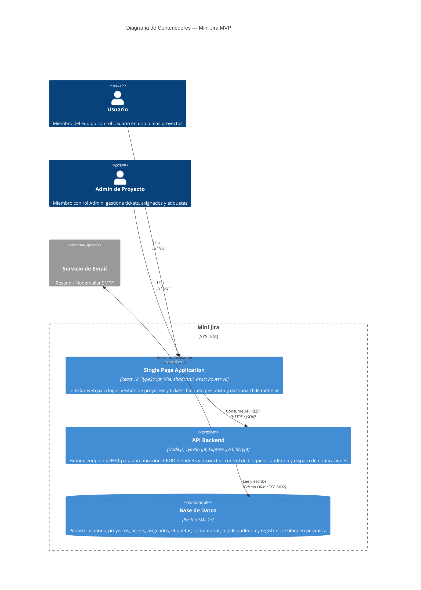

# Arquitectura — Mini Jira (Modelo C4 — Nivel Contenedores)

---

## Decisiones de diseño relevantes

| Área | Decisión | Justificación |
|---|---|---|
| Bloqueo pesimista | Tabla `TicketLock` en PostgreSQL con `expires_at` | Evita estado distribuido; el timeout se controla vía `LOCK_TIMEOUT_MINUTES` en env |
| Auditoría inmutable | Tabla `AuditLog` sin UPDATE ni DELETE | Garantiza trazabilidad de cambios de estado para el dashboard de métricas |
| Soft delete universal | Campos `archived_at` en `Ticket` y `Project` | Nunca se ejecuta `DELETE`; los registros archivados son recuperables |
| Roles por proyecto | Tabla `ProjectMember` con enum `ADMIN\|USER` | Un mismo usuario puede tener roles distintos en diferentes proyectos |
| Email síncrono | Llamada directa desde API al proveedor de email | Suficiente para MVP con equipo de 10 personas; sin necesidad de cola de mensajes |
| Sin superadmin global | Roles únicamente a nivel de proyecto | No existe caso de uso definido para el MVP |
