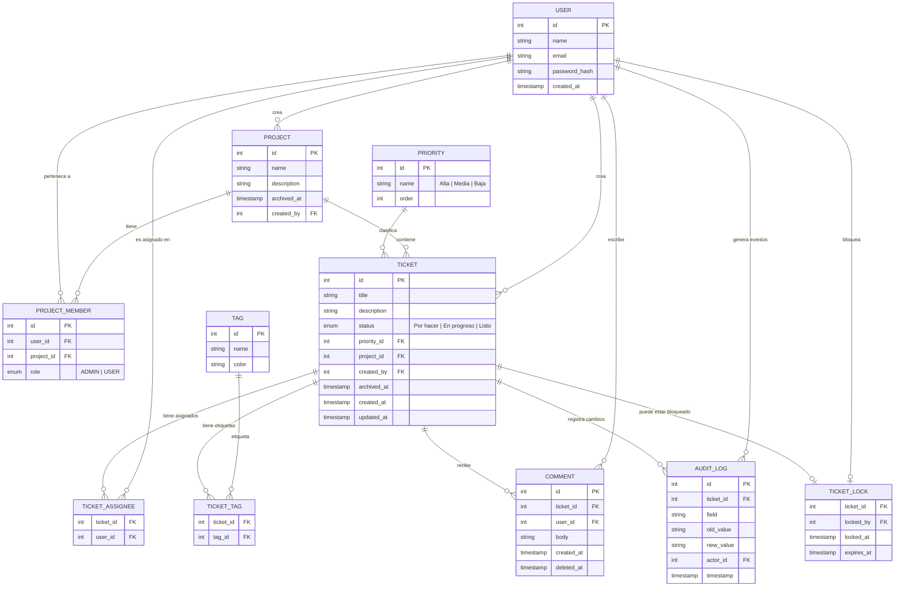

# Diagrama Entidad-Relación — Mini Jira

```mermaid
erDiagram
    USER {
        int id PK
        string name
        string email
        string password_hash
        timestamp created_at
    }

    PROJECT {
        int id PK
        string name
        string description
        timestamp archived_at
        int created_by FK
    }

    PROJECT_MEMBER {
        int id PK
        int user_id FK
        int project_id FK
        enum role "ADMIN | USER"
    }

    PRIORITY {
        int id PK
        string name "Alta | Media | Baja"
        int order
    }

    TICKET {
        int id PK
        string title
        string description
        enum status "Por hacer | En progreso | Listo"
        int priority_id FK
        int project_id FK
        int created_by FK
        timestamp archived_at
        timestamp created_at
        timestamp updated_at
    }

    TICKET_ASSIGNEE {
        int ticket_id FK
        int user_id FK
    }

    TAG {
        int id PK
        string name
        string color
    }

    TICKET_TAG {
        int ticket_id FK
        int tag_id FK
    }

    COMMENT {
        int id PK
        int ticket_id FK
        int user_id FK
        string body
        timestamp created_at
        timestamp deleted_at
    }

    AUDIT_LOG {
        int id PK
        int ticket_id FK
        string field
        string old_value
        string new_value
        int actor_id FK
        timestamp timestamp
    }

    TICKET_LOCK {
        int ticket_id FK
        int locked_by FK
        timestamp locked_at
        timestamp expires_at
    }

    PRIORITY ||--o{ TICKET : "clasifica"
    USER ||--o{ PROJECT : "crea"
    USER ||--o{ PROJECT_MEMBER : "pertenece a"
    PROJECT ||--o{ PROJECT_MEMBER : "tiene"
    PROJECT ||--o{ TICKET : "contiene"
    USER ||--o{ TICKET : "crea"
    TICKET ||--o{ TICKET_ASSIGNEE : "tiene asignados"
    USER ||--o{ TICKET_ASSIGNEE : "es asignado en"
    TICKET ||--o{ TICKET_TAG : "tiene etiquetas"
    TAG ||--o{ TICKET_TAG : "etiqueta"
    TICKET ||--o{ COMMENT : "recibe"
    USER ||--o{ COMMENT : "escribe"
    TICKET ||--o{ AUDIT_LOG : "registra cambios"
    USER ||--o{ AUDIT_LOG : "genera eventos"
    TICKET ||--o| TICKET_LOCK : "puede estar bloqueado"
    USER ||--o| TICKET_LOCK : "bloquea"
```
