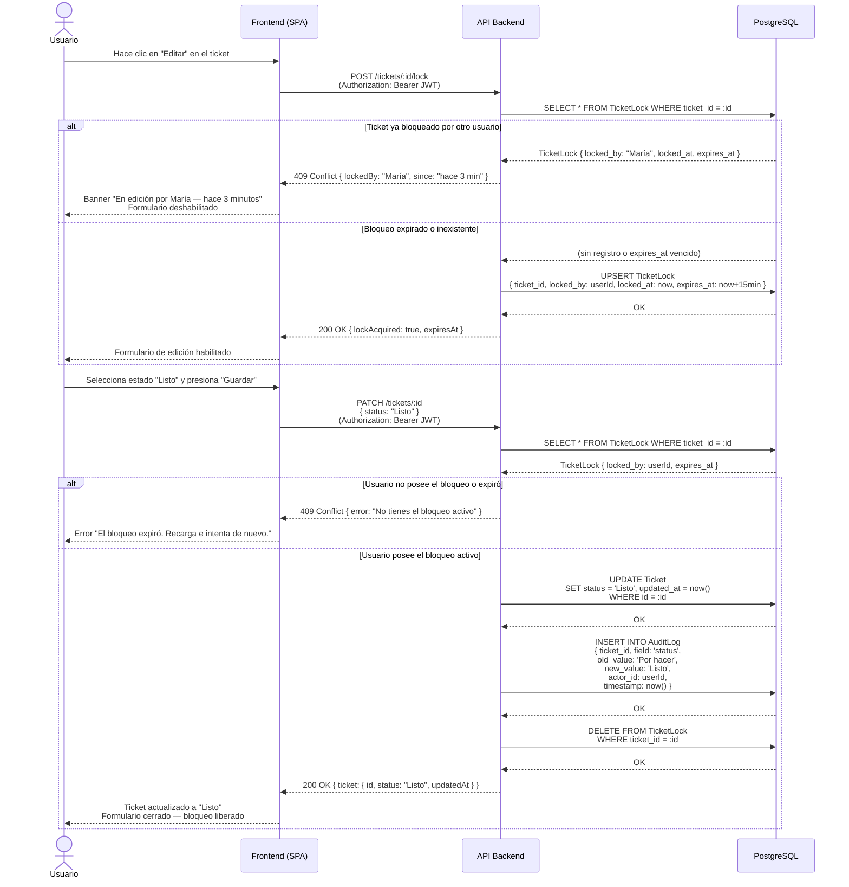

# Diagrama de Secuencia — Mover ticket de "Por hacer" a "Listo"

---

## Notas del flujo

| Paso | Regla de negocio aplicada |
|---|---|
| `POST /lock` | El bloqueo expira automáticamente a los 15 min (`LOCK_TIMEOUT_MINUTES`). Un bloqueo vencido se trata como inexistente. |
| `PATCH /tickets/:id` | El API re-valida la propiedad del bloqueo antes de cualquier escritura; no confía en el estado del cliente. |
| `INSERT AuditLog` | El registro es inmutable — no se emite `UPDATE` ni `DELETE` sobre esta tabla. Es la fuente del dashboard de métricas. |
| `DELETE TicketLock` | El bloqueo se libera únicamente al guardar. Si el usuario cancela, el frontend llama a `DELETE /tickets/:id/lock`. |
| Transiciones de estado | Son libres; no hay máquina de estados que restrinja el paso de "Por hacer" a "Listo" directamente. |
