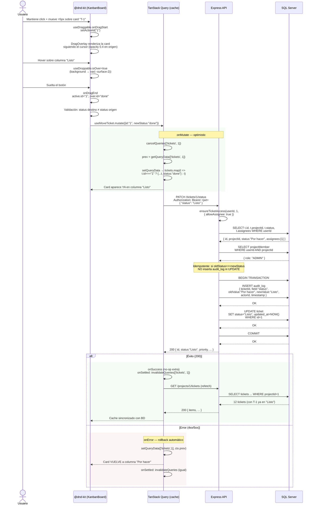
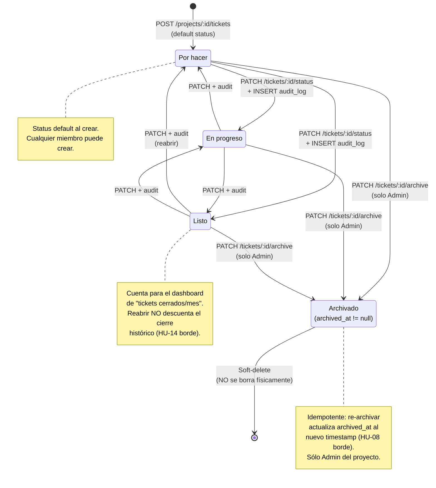

# Diagramas — Mini Jira

Tres diagramas Mermaid que documentan los flujos críticos del MVP. Mantenidos en
sincronía con el código en `backend/src/modules/auth/` y `backend/src/modules/tickets/`.

---

## 1. Auth con JWT — login + refresh rotation

Login con email/password y rotación single-use del refresh token. El access token
JWT (1h) viaja en `Authorization: Bearer <token>`; el refresh (7d) se persiste como
hash SHA-256 en `refresh_token` para detectar reuso. Si un refresh ya consumido se
intenta usar de nuevo, el backend asume robo y revoca toda la cadena del usuario.

```mermaid
sequenceDiagram
    actor User as Usuario
    participant FE as Frontend (Vite + React 19)
    participant API as Express API (:3030/api/v1)
    participant DB as SQL Server

    %% ── Login ──────────────────────────────────────────────────────────────
    rect rgb(245, 248, 253)
    Note over User,DB: 1. Login inicial
    User->>FE: Email + password
    FE->>API: POST /auth/login<br/>{ email, password }
    API->>DB: SELECT user WHERE email = :email
    alt Usuario no existe
        DB-->>API: null
        API-->>FE: 401 invalid_credentials<br/>(mensaje genérico — no revela existencia)
    else Usuario existe
        DB-->>API: user { id, passwordHash, name }
        API->>API: bcrypt.compare(password, user.passwordHash)
        alt Password no coincide
            API-->>FE: 401 invalid_credentials
        else Password OK
            API->>DB: SELECT projectId, role FROM project_member<br/>WHERE userId = :id
            DB-->>API: [{ projectId, role }]
            API->>API: signAccessToken({sub, email, roles}) — TTL 1h
            API->>API: signRefreshToken(userId, jti) — TTL 7d
            API->>DB: INSERT refresh_token<br/>(userId, tokenHash=sha256(refreshJWT), expiresAt)
            DB-->>API: OK
            API-->>FE: 200 { accessToken, refreshToken,<br/>expiresIn, user, roles }
            FE->>FE: localStorage.setItem('mj.access', accessToken)<br/>localStorage.setItem('mj.refresh', refreshToken)
        end
    end
    end

    %% ── Llamadas autenticadas ──────────────────────────────────────────────
    rect rgb(248, 252, 245)
    Note over User,DB: 2. Llamadas autenticadas
    FE->>API: GET /projects/1/tickets<br/>Authorization: Bearer <accessToken>
    API->>API: verifyAccessToken — valida firma + exp
    API-->>FE: 200 { items, ... }
    end

    %% ── Refresh rotation ───────────────────────────────────────────────────
    rect rgb(253, 248, 240)
    Note over User,DB: 3. Refresh (single-use rotation)
    Note over FE: Access token expirado (~1h)
    FE->>API: POST /auth/refresh<br/>{ refreshToken }
    API->>API: verifyRefreshToken — valida firma + exp
    API->>DB: SELECT * FROM refresh_token<br/>WHERE tokenHash = sha256(refreshJWT)
    alt Token desconocido o revoked
        DB-->>API: null OR revokedAt != null
        API-->>FE: 401 refresh_expired
    else Token ya consumido (REUSO detectado)
        DB-->>API: { consumedAt: <fecha> }
        Note right of API: ¡Posible robo del token!
        API->>DB: UPDATE refresh_token<br/>SET revokedAt = NOW()<br/>WHERE userId = :id AND revokedAt IS NULL
        DB-->>API: OK (toda la cadena del user revocada)
        API-->>FE: 401 refresh_expired<br/>"cadena revocada"
        FE->>FE: clearTokens() → redirect /login
    else Token válido
        DB-->>API: { consumedAt: null, revokedAt: null, expiresAt: <futuro> }
        API->>API: Emitir nuevo access + nuevo refresh
        API->>DB: INSERT refresh_token (nuevo hash)
        API->>DB: UPDATE refresh_token<br/>SET consumedAt = NOW(), replacedById = <newId><br/>WHERE id = <oldId>
        DB-->>API: OK
        API-->>FE: 200 { accessToken, refreshToken, expiresIn }
        FE->>FE: Reemplazar tokens en localStorage
    end
    end

    %% ── Logout ─────────────────────────────────────────────────────────────
    rect rgb(252, 245, 245)
    Note over User,DB: 4. Logout
    User->>FE: Click "Cerrar sesión"
    FE->>API: POST /auth/logout<br/>Authorization: Bearer <accessToken>
    API->>DB: UPDATE refresh_token<br/>SET revokedAt = NOW()<br/>WHERE userId = :id<br/>AND revokedAt IS NULL<br/>AND consumedAt IS NULL
    DB-->>API: OK
    API-->>FE: 204
    FE->>FE: localStorage.removeItem('mj.access' / 'mj.refresh')<br/>redirect /login
    end
```

---

## 2. Mover ticket — Drag-and-drop con AuditLog

El usuario arrastra una card en el Kanban. TanStack Query aplica un **optimistic
update** sobre el cache para que la card se mueva al instante; el `PATCH` real al
backend ejecuta una transacción atómica `INSERT audit_log + UPDATE ticket`.
Si la transacción falla (status fuera de catálogo, ticket archivado, etc.), el
`onError` revierte el cache y la card vuelve a su columna original.

---

## 3. Ciclo de vida del ticket

Las tres columnas del Kanban son los estados activos. Las transiciones son **libres**
(cualquier estado → cualquier otro) — no hay máquina de estados restrictiva.
Sólo el Admin del proyecto puede archivar (soft-delete vía `archived_at`).
Cada cambio de status genera una fila inmutable en `audit_log`.

### Reglas adicionales del ciclo

| Aspecto | Regla |
|---|---|
| Default al crear | `status = 'Por hacer'` (CHECK constraint en BD, schema.prisma) |
| Quién cambia status | Admin del proyecto **o** asignado al ticket (`ensureTicketAccess { allowAssignee: true }`) |
| Quién archiva | Sólo Admin del proyecto (`ensureTicketAccess { adminOnly: true }`) |
| Cambio de status idempotente | Si `oldStatus === newStatus` → no INSERT en audit_log ni UPDATE |
| Auditoría | Cada cambio de status genera fila inmutable: `{field:'status', oldValue, newValue, actorId, timestamp}` |
| Lock pesimista | **Diferido a Phase B** — `PATCH /tickets/:id/status` ya enforce miembro pero aún no requiere lock activo |

---

**Fuentes:**
- `backend/src/modules/auth/service.ts` — flujos `login`, `refresh`, `logout`
- `backend/src/modules/tickets/service.ts` — `changeTicketStatus` (líneas 195-229)
- `frontend/src/features/board/board-hooks.ts` — `useMoveTicket` con optimistic
- `frontend/src/components/board/KanbanBoard.tsx` — DndContext + DragOverlay
- `Base-Specs/specs.md` §2.3 — transiciones libres de status
- `Base-Specs/secuencia.md` — versión Phase B con lock pesimista (referencia)
